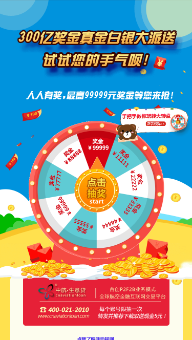
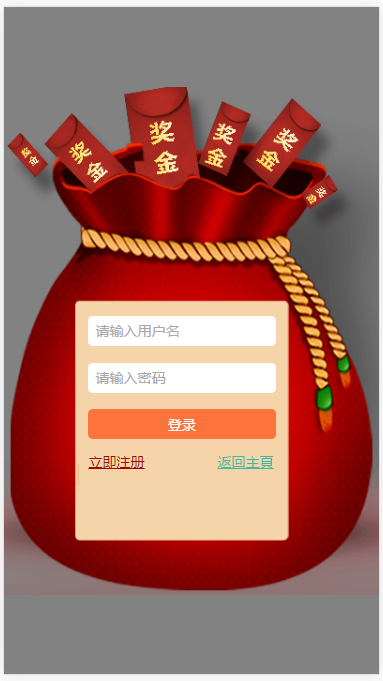
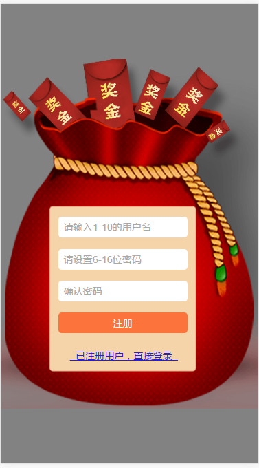
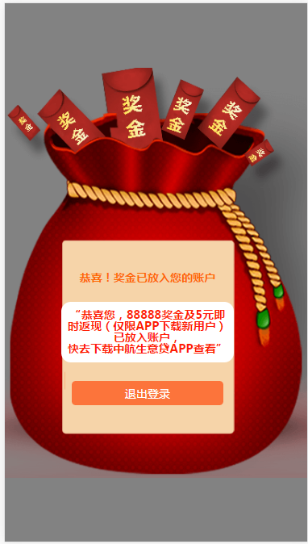
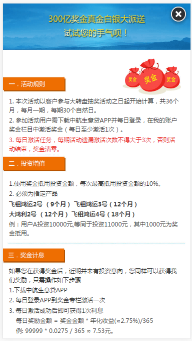

我们使用 jQuery + rem.js +css3 实现前端页面的设计，最终效果图如下:

**主页**



**登录页**



**注册页**



**结果页**



**规则页**




## 4.5.1 组件

前面提到过，我们可以将模板拆分成一些组件，然后使用 ejs 的 include 方法将组件组合起来进行渲染。我们将页面切分成以下组件：


根据上面的组件切分图，我们创建以下样式及模板文件：

**public/css/style.css**

```
/* ---------- 全局样式 ---------- */

.res_success {
	width: 100%;
	height: 28.45866667rem;
	background: url(/img/20160728success.jpg) no-repeat;
	background-size: 100% 100%;
}
.yaoQing {
	color: #c49c44;
	position: absolute;
	font-size: 1.5rem;
	margin-top: 17.1rem;
	margin-left: 5.7rem;
}
.res_success .backImg {
	width: 3.712rem;
	margin-top: 22rem;
	margin-left: 1rem;
	margin-right: 1rem;
}
.res_success .realName {
	width: 8.72533333rem;
}
.container {
	width: 100%;
	height: 48.384rem;
	background: url(/img/bbjj.png) no-repeat;
	background-size: 100% 100%;
}
#wheel {
	width: 11.86133333rem;
	height: 11.86133333rem;
	position: absolute;
	z-index: 1;
	background: url(/img/zhuanp03.gif) no-repeat center center;
	background-size: 100% 100%;
	margin-top: 10rem;
	margin-left: 2.1rem;
}
#arrow {
	width: 4.90666667rem;
	height: 4.90666667rem;
	position: absolute;
	z-index: 2;
	background: url(/img/zhuanp01.gif) no-repeat;
	background-size: 100% 100%;
	left: 50%;
	-webkit-transform: translate(-50%, 0);
	transform: translate(-50%, 0);
	margin-top: 13rem
}
.layer {
	position: fixed;
	top: 0;
	bottom: 0;
	right: 0;
	left: 0;
	z-index: 999;
	background: rgba(4, 4, 4, 0.5);
}
.register {
	width: 16rem;
	height: 21.67466667rem;
	background: url(/img/register.png) no-repeat;
	background-size: 100% 100%;
	position: absolute;
	z-index: 2;
	-webkit-transform: translateY(-50%);
	        transform: translateY(-50%);
    top: 50%;
}
.logina{
	text-decoration: underline;
	color: #211ce8;
}
.form, .setpwd, .login {
	width: 9.3rem;
	padding: 0.7rem 0rem;
	margin-top: 9.1rem;
	margin-left: 3rem;
	box-sizing: border-box;
}
.congr {
	width: 9.1rem;
	padding: 0.7rem 0rem;
	margin-top: 9.1rem;
	margin-left: 3rem;
	box-sizing: border-box;
}
.form p, .setpwd p, .login p {
	margin-bottom: 0.7rem;
	text-align: center;
	-webkit-display: flex;
	display: -webkit-box;
	display: -ms-flexbox;
	display: flex;
	padding-left: 0.6rem;
}
.setpwd p {
	margin-bottom: 1rem;
}
.tel, .pwd, .compwd, .username, .password {
	width: 8rem;
	height: 1.28rem;
	border: 0;
	border-radius: 0.2rem;
	text-indent: 0.3rem;
	font-size: 0.6rem;
	outline: 0;
	padding: 0;
}
.setpwd p:nth-child(1) {
	margin-top: 1rem;
}
.code {
	width: 5rem;
	height: 1.28rem;
	border: 0;
	border-radius: 0.2rem;
	border-top-right-radius: 0;
	border-bottom-right-radius: 0;
	text-indent: 0.3rem;
	font-size: 0.6rem;
	outline: 0;
	padding: 0;
}
.invitecode {
	width: 5rem;
	height: 1.28rem;
	border: 0;
	border-radius: 0.2rem;
	border-top-right-radius: 0;
	border-bottom-right-radius: 0;
	text-indent: 0.3rem;
	font-size: 0.6rem;
	outline: 0;
	padding: 0;
	color: #999;
}
#codespan {
	display: inline-block;
	width: 3rem;
	height: 1.28rem;
	border-radius: 0.2rem;
	border-top-left-radius: 0;
	border-bottom-left-radius: 0;
	background: #ff6633;
	color: #fff;
	border: 0;
	outline: 0;
}
.telcode {
	display: inline-block;
	width: 5rem;
	height: 1.28rem;
	border: 0;
	border-radius: 0.2rem;
	border-top-right-radius: 0;
	border-bottom-right-radius: 0;
	text-indent: 0.3rem;
	font-size: 0.6rem;
	outline: 0;
	padding: 0;
}
#sendcode {
	width: 3rem;
	height: 1.28rem;
	border: 0;
	outline: 0;
	background: #ff6633;
	font-size: 0.4rem;
	border-radius: 0.2rem;
	border-top-left-radius: 0;
	border-bottom-left-radius: 0;
	white-space: nowrap;
	color: #fff;
}
.invite {
	width: 3rem;
	height: 1.28rem;
	line-height: 1.28rem;
	border: 0;
	outline: 0;
	background: #ff6633;
	font-size: 0.4rem;
	border-radius: 0.2rem;
	border-top-left-radius: 0;
	border-bottom-left-radius: 0;
	white-space: nowrap;
	color: #fff;
}
#reg, #sub, #look, #loginin {
	width: 8rem;
	height: 1.28rem;
	border: 0;
	border-radius: 0.2rem;
	font-size: 0.6rem;
	outline: 0;
	background: #fc743b;
	color: #fff;
}
.form div {
	text-align: center;
}
.form a {
	color: #211ce8;
	font-size: 0.6rem;
}
.teltips, .codetips, .telcodetips {
	position: absolute;
	color: red;
	font-size: 0.4rem;
	margin-top: -0.5rem;
	text-indent: 0.65rem;
}
.pwdtips, .compwdtips, .usernametips, .passwordtips {
	position: absolute;
	color: #cc8305;
	font-size: 0.4rem;
	margin-top: -0.7rem;
	text-indent: 0.65rem;
}
.congr > p {
	color: #fe6804;
	font-size: 0.6rem;
	font-weight: bold;
	text-align: center;
	margin-top: 1rem;
}
.mes {
	margin-top: 1rem;
	background: #fff;
	border-radius: 0.5rem;
	padding: 0.4rem 0;
}
.mes > p {
	color: #fe1c04;
	font-size: 0.4rem;
	font-weight: bold;
	text-align: center;
}
.rules {
	width: 100%;
	text-align: center;
	position: absolute;
	margin-top: 27.7rem;
}
.rules span {
	color: transparent;
	font-size: 0.7rem;
}
.tech {
	position: fixed;
	z-index: 1;
	right: 0;
	top: 7.68rem;
}
.tech img {
	width: 6.4rem;
}
.ruletext p {
	font-family: "微软雅黑";
	font-size: 12px;
	color: #343434;
	padding: 0 1rem 0 0.5rem;
	line-height: 0.8rem;
	margin-bottom: 0.1rem;
}
.ruletext .red {
	color: #ea241c;
}
.message{
	text-align: center;
	color: red;
}
```

**views/header.ejs**

```
<!DOCTYPE html>
<html lang="en">
<head>
	<meta charset="UTF-8"> 
	<title><%= title %> - 百分之百中大奖 - 中航生意贷</title>
	<meta name="viewport" content="width=device-width,initial-scale=1.0,maximum-scale=1.0,minimum-scale=1.0,user-scalable=no" />
	<meta content="telephone=no" name="format-detection" />
	<meta name="apple-mobile-web-app-capable" content="yes" />
	<meta name="apple-mobile-web-app-status-bar-style" content="black" />
	<meta name="description" content="中航生意贷推出系列理财活动，注册有礼、推荐有礼，投资有红包返现等等，活动奖励不断。" />
	<meta name="keywords" content="平台活动、网络理财、个人理财、中航生意贷" />
	<script type="text/javascript" src="/lib/rem/rem.js"></script>
	<script type="text/javascript" src="/lib/zepto/zepto.js"></script>
	<link rel="stylesheet" type="text/css" href="/lib/reset/reset.css">
	<link rel="stylesheet" href="/css/style.css">	
	<style type="text/css" id="style"></style>
</head>
<body>
```

**views/footer.ejs**

```
  </body>
</html>

```

**views/error.ejs**

```
<!DOCTYPE html>
<html>
  <head>
    <meta charset="utf-8">
    <title>报错页面</title>
    <link rel="stylesheet" href="/css/style.css">
  </head>
  <body>
    <h2><%= error.message %></h2>
    <p><%= error.stack %></p>
  </body>
</html>

```

**views/home.ejs**

```
<%- include('header') %>

	<!-- 分享至微信、qq等应用时携带的图像-->
	<div style='width:0px; height:0px; overflow:hidden;'>
		
	</div>

	<!-- 首页主体部分-->
	<section class="container">
		<div id="wheel">
			
		</div>
		<% if (user) { %>
			<div id="arrow"></div>
		<% } else { %>
			<a href="/login/"><div id="arrow"></div></a>
		<% } %>
		<div class="tech">
			<a href="/">
				
			</a>
		</div>
		<div class="rules">
			<a href="/rule/"><span id="rule">点我了解活动规则</span></a>
		</div>
	</section>
	
<% if (success) { %>
<script type="text/javascript">				  
	alert("<%= success %>!");
</script>	
<% } %>	

<% if (user && money) { %>	
<script type="text/javascript">				  	
	var money = <%= money %>;
	var n = (Number(money)/11111)+1;
	var str = "@keyframes run {0% {transform: rotate(0deg);}100% { transform: rotate("+(-(3600+((n-1)*40)))+"deg);}}@-webkit-keyframes run {0% {transform: rotate(0deg); }100% { transform: rotate("+(-(3600+((n-1)*40)))+"deg);}}";
	$("#style").html(str);
	$("#wheel").css("animation","run 3s 1 ease-in-out forwards");
	$("#wheel").css("-webkit-animation","run 3s 1 ease-in-out forwards");
	setTimeout(function(){
		window.location.href="/result/";
	},5000);	  		
</script>
<% } %>
<%- include('footer') %>


```

**views/login.ejs**

```
<%- include('header') %>
<div class="layer">
	<div class="register">
		<form class="login" method="post">
			<p><input type="text" name="name" class="username" placeholder="请输入用户名"></p>
			<p><input type="password" name="password" class="password" placeholder="请输入密码"></p>
			<% if (error) { %>
			  <div class="error codetips">
			    <div><%= error %></div>
			  </div>
			<% } %>
			<p>
				<input type="submit" id="loginin" value="登录">
			</p>
			<p><span style="font-size:0.6rem;color:#a40000;text-decoration: underline;float: left;" onclick='window.location.href="/reg/"'>立即注册</span><span style="font-size:0.6rem;color:#3bba9f;position: absolute;right: 4.5rem;text-decoration: underline;" onclick='sessionStorage.setItem("url",window.location.href);window.location.href="/";'>返回主頁</span></p>
		</form>
	</div>
</div>
<% if (success) { %>	
<script type="text/javascript">				  
	alert("<%= success %>!");		  		
</script>
<% } %>
<%- include('footer') %>

```

**views/reg.ejs**

```
<%- include('header') %>
<div class="layer">
	<div class="register">
		<form class="form"  method="post" enctype="multipart/form-data">
			<p>
				<input type="text" name="name" class="username" id="username" placeholder="请输入1-10的用户名">
			</p>			
			<p>
				<input type="password" name="password" class="pwd" id="pwd" placeholder="请设置6-16位密码">
			</p>
			<p>
				<input type="password" name="repassword" class="compwd" id="compwd" placeholder="确认密码">
			</p>
			<% if (error) { %>
			  <div class="error codetips">
			    <div><%= error %></div>
			  </div>
			<% } %>
			<p>
				<input type="submit" id="reg" value="注册">
			</p>
			<div>
				<a href="/login/" class="logina">&nbsp;&nbsp;已注册用户，直接登录&nbsp;&nbsp;</a>
			</div>
		</from>
	</div>	
</div>
<script type="text/javascript" src="/js/reg.js"></script>
<%- include('footer') %>

```

**views/result.ejs**

```
  <%- include('header') %>
<section class="layer">
		<div class="register">
			
			<div class="congr">
				<p>恭喜！奖金已放入您的账户</p>				
				<div class="mes">
					<p class="money" style="font-size:0.6rem;">“恭喜您，<%= money %>奖金及5元即</p>
					<p style="font-size:0.6rem;">时返现（仅限APP下载新用户）</p>
					<p style="font-size:0.6rem;">已放入账户，</p> 
					<p style="font-size:0.6rem;">快去下载中航生意贷APP查看”</p>
				</div>
				<p><a href="/signout/"><button id="look">退出登录</button></a></p>
			</div>
			
			
		</div>
</section>
<%- include('footer') %>

```

**views/rule.ejs**

```
  <%- include('header') %>
<section class="ruletext" style="position:absolute;z-index:11111;width:100%;height: 57rem;background:#fff;">
		<span style="display:inline-block;position: absolute;right:0;z-index:11112;width:2.048rem;height:2.048rem;background:url(/img/closed.png) no-repeat;" id="closed" onclick='window.location.href="/"'></span>
		
		<p>1. 本次活动以客户参与大转盘抽奖活动之日起开始计算，共36个月，每月一期，每期30个自然日。</p>
		<p>2. 参加活动用户需下载中航生意贷APP并每日登录，在我的账户奖金栏目中激活奖金（每日至少激活1次）。</p>
		<p class="red">3. 每日激活任务，每期活动遗漏激活次数不得大于3次，否则活动结束，奖金清零。</p>
		
		<p>1.使用奖金抵用投资金额，每次最高抵用投资金额的10%。</p>
		<p>2. 必须为指定产品 </p>
		<p style="font-weight:bold;">飞租鸿运2号 （9个月）   飞租鸿运3号（12个月） </p>
		<p style="font-weight:bold;">大鸿利2号 （12个月）    飞租鸿运4号（18个月）</p>
		<p>例：用户A投资10000元,等同于投资11000元，其中1000元为奖金抵用。</p>
		
		<p>如果您在获得奖金后，近期并未有投资意向，您同样可以获得我们奖励，只需操作如下步骤</p>
		<p>1.下载中航生意贷APP</p>
		<p>2. 每日登录APP到奖金专栏激活一次</p>
		<p>3. 每日激活成功后即可获得1次利息</p>
		<p style="text-indent:0.6rem;">每日奖励金额 = 奖金金额 * 年化收益(≈2.75%)/365</p>
		<p style="text-indent:0.6rem;">例: 99999 * 0.0275 / 365 ≈ 7.53元。</p>
		<p>4. 提现方式：连续完成30个自然日激活任务即可提现。</p>
		
		<p>满足以下条件即可提现所获得的奖金</p>
		<p>1.本人累计完成激活任务36期</p>
		<p>2.推荐100个好友下载中航生意贷APP，注册、充值并投资；</p>
		<p>3.推荐的好友用户自下载APP当日起计算，每半年登陆一次，并连续一年。</p>
		
		<p>1.下载中航生意贷APP，注册并实名认证即可获得5元现金；</p>
		<p>2. 推荐好友下载中航生意贷APP，注册并实名认证，您的好友可获得5元现金，同时您也可以再次获得5元现金；</p>
		<p>3. 现金奖励将在审核通过后到帐。</p>
		<p class="red" style="margin-top:0.5rem;margin-bottom: 0.5rem;">注：本次参加活动的客户须满18周岁;</p>
		<p class="red" style="padding-left:1.5rem;margin-bottom: 0.5rem;">新注册用户首次奖金结息可正常提现，第二、三次结息需在平台充值并投资1000元（30天及以上标的）后可提现，从第四次开始需在平台充值并投资10000元（三个月及以上标的）后可提现;</p>
		<p class="red" style="padding-left:1.5rem;margin-bottom: 0.5rem;">用户推荐邀请的前5位用户可正常领取5元现金（下载奖励和推荐奖励），从第6位开始，之后的被邀请人都需要充值并投资1000元（30天及以上标的）后，邀请人可领取5元现金（推荐奖励）;</p>
		<p class="red" style="padding-left:1.5rem;margin-bottom: 0.5rem;">本活动不与中航生意贷平台其他优惠活动共享本次活动，活动计结息规则如有调整，请以实际操作为准;</p>
		<p class="red" style="padding-left:1.5rem;">中航·生意贷在法律规定的范围内享有本活动的解释权</p>
		
</section>
<%- include('footer') %>

```


## 4.5.2 app.locals 和 res.locals

上面的模板中我们用到了 title、user、success、error 变量，我们，将 user、success、error 挂载到 `res.locals` 下。为什么要这么做呢？`app.locals` 和 `res.locals` 是什么？它们有什么区别？

express 中有两个对象可用于模板的渲染：`app.locals` 和 `res.locals`。我们从 express 源码一探究竟：

**express/lib/application.js**

```
app.render = function render(name, options, callback) {
  ...
  var opts = options;
  var renderOptions = {};
  ...
  // merge app.locals
  merge(renderOptions, this.locals);

  // merge options._locals
  if (opts._locals) {
    merge(renderOptions, opts._locals);
  }

  // merge options
  merge(renderOptions, opts);
  ...
  tryRender(view, renderOptions, done);
};
```

**express/lib/response.js**

```
res.render = function render(view, options, callback) {
  var app = this.req.app;
  var opts = options || {};
  ...
  // merge res.locals
  opts._locals = self.locals;
  ...
  // render
  app.render(view, opts, done);
};
```

可以看出：在调用 `res.render` 的时候，express 合并（merge）了 3 处的结果后传入要渲染的模板，优先级：`res.render` 传入的对象> `res.locals` 对象 > `app.locals` 对象，所以 `app.locals` 和 `res.locals` 几乎没有区别，都用来渲染模板，使用上的区别在于：`app.locals` 上通常挂载常量信息（如博客名、描述、作者信息），`res.locals` 上通常挂载变量信息，即每次请求可能的值都不一样（如请求者信息，`res.locals.user = req.session.user`）。


这样在调用 `res.render` 的时候就不用传入这四个变量了，express 为我们自动 merge 并传入了模板，所以我们可以在模板中直接使用这四个变量。

上一节：[4.4 功能设计](https://github.com/se7en-1992/lottery/blob/master/book/4.4%20%E5%8A%9F%E8%83%BD%E8%AE%BE%E8%AE%A1.md)

下一节：[4.6 连接数据库](https://github.com/se7en-1992/lottery/blob/master/book/4.6%20%E8%BF%9E%E6%8E%A5%E6%95%B0%E6%8D%AE%E5%BA%93.md)
